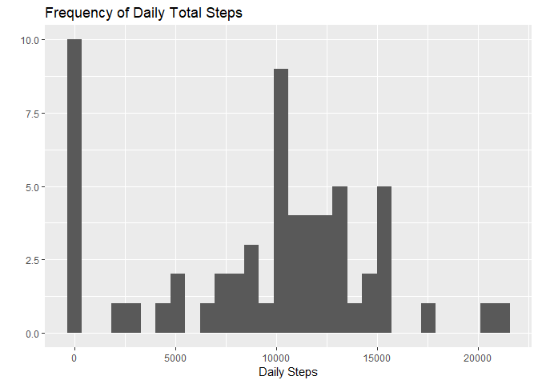
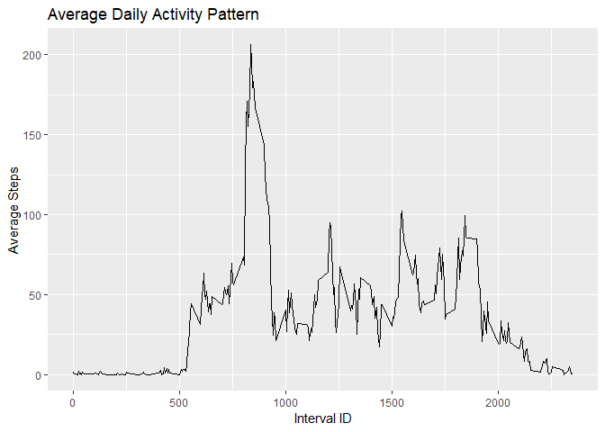
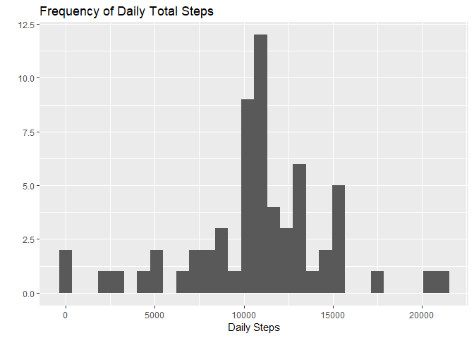
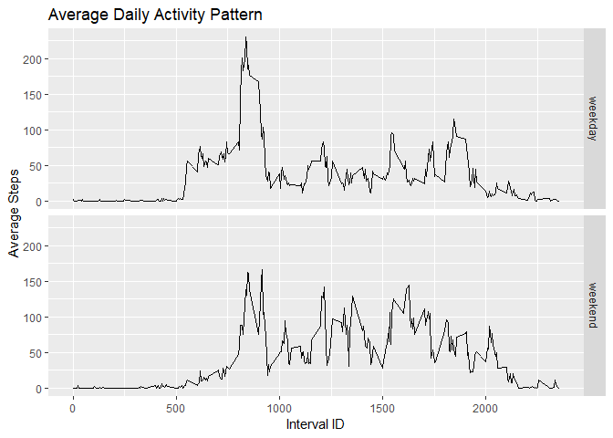

## Loading and preprocessing the data

Read in the data and look at a summary

```r
data <- read.csv("activity.csv")
summary(data)
```

```
##      steps                date          interval     
##  Min.   :  0.00   2012-10-01:  288   Min.   :   0.0  
##  1st Qu.:  0.00   2012-10-02:  288   1st Qu.: 588.8  
##  Median :  0.00   2012-10-03:  288   Median :1177.5  
##  Mean   : 37.38   2012-10-04:  288   Mean   :1177.5  
##  3rd Qu.: 12.00   2012-10-05:  288   3rd Qu.:1766.2  
##  Max.   :806.00   2012-10-06:  288   Max.   :2355.0  
##  NA's   :2304     (Other)   :15840
```

Definitely some NAs in this data but we will look into that later.
It looks like it would be a good idea to convert interval which is a coded value to a factor variable which I have done below


```r
data$interval = as.factor(data$interval)
summary(data)
```

```
##      steps                date          interval    
##  Min.   :  0.00   2012-10-01:  288   0      :   61  
##  1st Qu.:  0.00   2012-10-02:  288   5      :   61  
##  Median :  0.00   2012-10-03:  288   10     :   61  
##  Mean   : 37.38   2012-10-04:  288   15     :   61  
##  3rd Qu.: 12.00   2012-10-05:  288   20     :   61  
##  Max.   :806.00   2012-10-06:  288   25     :   61  
##  NA's   :2304     (Other)   :15840   (Other):17202
```

Notice the change in summary data. This looks ready for analysis.


## What is mean total number of steps taken per day?

First we aggregate the step data by day and then we display as a histogram
Import ggplot2 and create a histogram


```r
library(ggplot2)
```

```
## Warning: package 'ggplot2' was built under R version 3.4.4
```

```r
daily_steps <- aggregate(data$steps, by=list(data$date), FUN=sum, na.rm = TRUE)

qplot(daily_steps$x, geom="histogram") + xlab("Daily Steps") + ggtitle("Frequency of Daily Total Steps") 
```

```
## `stat_bin()` using `bins = 30`. Pick better value with `binwidth`.
```

<!-- -->

Now I calculate the mean and median number of steps per day


```r
mean(daily_steps$x)
```

```
## [1] 9354.23
```

```r
median(daily_steps$x)
```

```
## [1] 10395
```


## What is the average daily activity pattern?

Now we aggregate by 5 minute interval and take the average across all days for that interval


```r
interval_steps <- aggregate(data$steps, by=list(data$interval), FUN=mean, na.rm=TRUE)
interval_steps$Group.1 = as.numeric(as.character(interval_steps$Group.1))

ggplot(interval_steps,aes(Group.1,x)) + geom_line() + xlab("Interval ID") + ylab("Average Steps") + ggtitle("Average Daily Activity Pattern")
```

<!-- -->

We can now see that the max number of steps per 5 minute interval happens at the follow interval ID:


```r
interval_steps[interval_steps$x == max(interval_steps$x),'Group.1']
```

```
## [1] 835
```


## Imputing missing values

First We will find how many rows are NA
 

```r
nrow(data[is.na(data$steps),])
```

```
## [1] 2304
```
 
Now fill in NAs with the mean for that interval across all days using an impute function that looks up the mean for that interval


```r
impute <- function(x, y){
  if(is.na(x)){
    value = interval_steps$x[interval_steps$Group.1 == y]
  } else {
    value = x
  }
  return(value)
}

data_filled <- data.frame(data)
data_filled$steps <- apply(data_filled,1, function(x) impute(x['steps'],x['interval'])) 
```

Now we have 0 NA rows:


```r
nrow(data_filled[is.na(data_filled$steps),])
```

```
## [1] 0
```

We now repeat the original analysis of creating a histogram and reporting daily mean and median


```r
daily_steps_filled <- aggregate(as.numeric(data_filled$steps), by=list(data_filled$date), FUN = sum, na.rm = TRUE)


qplot(daily_steps_filled$x, geom="histogram") + xlab("Daily Steps") + ggtitle("Frequency of Daily Total Steps") 
```

```
## `stat_bin()` using `bins = 30`. Pick better value with `binwidth`.
```

<!-- -->

```r
mean(daily_steps_filled$x)
```

```
## [1] 10766.19
```

```r
median(daily_steps_filled$x)
```

```
## [1] 10766.19
```


WE now see that our median and mean are equal and both hire than before. Imputing data served to center the data and remove the skew we saw when missing values existed

## Are there differences in activity patterns between weekdays and weekends?

Add new factor variable indicating weekdays into imputed data set


```r
data_filled$day_type <- weekdays(as.Date(data_filled$date))
data_filled$day_type[data_filled$day_type == 'Sunday' | data_filled$day_type == 'Saturday'] <- 'weekend'
data_filled$day_type[data_filled$day_type != 'weekend'] <- 'weekday'
data_filled$day_type <- as.factor(data_filled$day_type)
```

Plot the results:


```r
interval_steps_days <- aggregate(as.numeric(data_filled$steps), by=list(data_filled$interval,data_filled$day_type), FUN=mean, na.rm=TRUE)
interval_steps_days$Group.1 = as.numeric(as.character(interval_steps_days$Group.1))

ggplot(interval_steps_days,aes(Group.1,x)) + geom_line() + xlab("Interval ID") + ylab("Average Steps") + ggtitle("Average Daily Activity Pattern") + facet_grid(Group.2 ~ .)
```

<!-- -->


AS seen from the plot. Weekend son average seem to have a later start and lower overall peaks throughout the day indicating less activity on weekdns overall.

